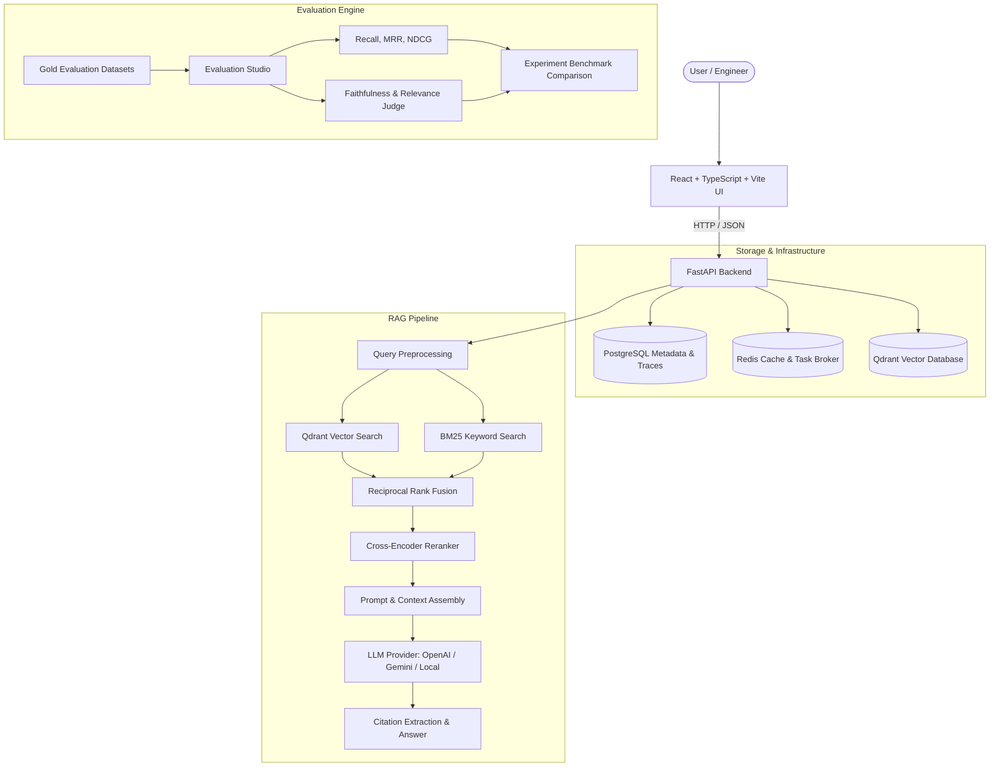

# AVOM — Evaluation-First RAG Engineering & Observability Platform

> **AVOM** is a production-grade, evaluation-first RAG engineering platform where teams ingest knowledge, configure dense/sparse/hybrid retrieval pipelines, query them, inspect retrieval and generation behavior down to the chunk level, run systematic evaluation benchmarks, compare experiments, and monitor RAG quality.

---

## Key Capabilities

1. **Hybrid Retrieval with Fusion**: Dense vector retrieval (Qdrant) combined with Sparse BM25 and Reciprocal Rank Fusion (RRF).
2. **Cross-Encoder Reranking**: Configurable reranking using models such as `BAAI/bge-reranker-base` to maximize context relevance.
3. **Retrieval Inspector**: Inspect initial ranks, reranked ranks, dense similarity, and sparse scores for every retrieved chunk.
4. **LLM-as-a-Judge Evaluation Engine**: Measure **Recall@K**, **Precision@K**, **MRR**, **NDCG**, **Faithfulness**, **Answer Relevance**, and **Citation Correctness** with structured JSON output.
5. **A/B Experiment Tracking**: Compare chunking sizes, retrieval top-k, and reranking configurations side-by-side with delta analysis.
6. **OpenTelemetry-Compatible Observability**: Capture latency breakdowns, token consumption, and failure categories (`HALLUCINATION`, `BAD_RETRIEVAL`, `INSUFFICIENT_CONTEXT`).

---

## Architecture Overview



---

## Tech Stack

| Layer | Technology |
|---|---|
| **Frontend** | React 18, TypeScript, Vite, Tailwind CSS, TanStack Query, React Router, Lucide Icons |
| **Backend** | Python 3.11+, FastAPI, Pydantic v2, SQLAlchemy 2.0 (Async), Alembic, Pytest |
| **Vector DB** | Qdrant (Dense Vector Search with Cosine/Dot Similarity) |
| **Relational DB** | PostgreSQL 16 (Documents, Chunks, Datasets, Evaluations, Traces) |
| **Cache & Tasks** | Redis 7 + Celery / Background Workers |
| **Observability** | OpenTelemetry spans, latency telemetry, token & cost tracking |

---

## Getting Started

### 1. Local Development (Quick Start)

Copy the environment file:
```bash
cp .env.example .env
```

#### Backend:
```bash
cd apps/backend
python -m venv .venv
# On Windows: .venv\Scripts\activate
# On Linux/macOS: source .venv/bin/activate
pip install -r requirements.txt
uvicorn app.main:app --reload --port 8000
```
Backend health check: [http://localhost:8000/health](http://localhost:8000/health)  
Interactive API Docs (Swagger UI): [http://localhost:8000/docs](http://localhost:8000/docs)

#### Frontend:
```bash
cd apps/frontend
npm install
npm run dev
```
Frontend Dashboard: [http://localhost:5173](http://localhost:5173)

---

### 2. Docker Compose Deployment

To run the complete platform with PostgreSQL, Redis, Qdrant, Backend, and Frontend:
```bash
docker compose up --build -d
```
All services will initialize with automated healthchecks:
- Frontend: `http://localhost:3000`
- Backend API: `http://localhost:8000`
- Qdrant Dashboard: `http://localhost:6333/dashboard`

---

## Platform Status & Completed Phases

| Phase | Module | Status | Highlights |
|---|---|---|---|
| **Phase 1** | Foundation & Infrastructure | Completed | Docker Compose, FastAPI, PostgreSQL, Qdrant in-memory fallback, Health checks |
| **Phase 2** | Authentication & RBAC | Completed | JWT authentication, bcrypt hashing, User & Admin role guards |
| **Phase 3** | Projects & Multi-Tenancy | Completed | Strict project workspace boundaries, tenant-isolated vector search |
| **Phase 4** | Document Ingestion & Chunking | Completed | PDF, DOCX, TXT/MD parsers, Fixed/Recursive/Semantic chunkers, SHA-256 deduplication |
| **Phase 5** | Retrieval Engine | Completed | Okapi BM25 indexer, Dense vector search, Reciprocal Rank Fusion (RRF) |
| **Phase 6** | Reranking Engine | Completed | Cross-encoder reranker with local lexical/semantic scoring fallback |
| **Phase 7** | Generation & Citations | Completed | Grounded synthesis prompts, citation extraction `[1]`, latency & token tracking |
| **Phase 8** | Evaluation Datasets & QA | Completed | Dataset models, QA ground truth pairs, bulk example import/export |
| **Phase 9** | Evaluation Metrics & Judge | Completed | Exact Recall@K, Precision@K, MRR, NDCG@K, Faithfulness, Relevance, Context Recall |
| **Phase 10**| Experiments & A/B Benchmarking | Completed | Multi-run matrix comparison, metric deltas against baseline, radar/bar comparison |
| **Phase 11**| Observability & Tracing | Completed | OpenTelemetry-compatible waterfall spans, per-step latency profiling |
| **Phase 12**| Dashboard & Production Polish | Completed | Live aggregated telemetry, recent runs activity, zero-mock UI |

---

## Running Tests

Run backend unit and integration tests (37 tests across 10 suites):
```bash
cd apps/backend
pytest -v
```

Build the frontend production bundle:
```bash
cd apps/frontend
npm run build
```

---

## Project Structure

```text
avom/
├── apps/
│   ├── backend/               # FastAPI application
│   │   ├── app/
│   │   │   ├── api/v1/        # API route controllers (health, auth, projects, documents, query, datasets, evaluations, experiments, traces, dashboard)
│   │   │   ├── core/          # Config, Database, Vector connections
│   │   │   ├── models/        # SQLAlchemy ORM models (User, Project, Document, Chunk, Dataset, Example, Run, Result, Trace)
│   │   │   ├── schemas/       # Pydantic v2 validation models
│   │   │   ├── services/      # Ingestion, Retrieval, Evaluation, LLM, Tracing
│   │   │   └── workers/       # Background task definitions
│   │   └── tests/             # Automated test suite (37 passing tests)
│   └── frontend/              # React + Vite + Tailwind dashboard
│       └── src/
│           ├── components/    # Reusable UI & Layout components
│           ├── pages/         # Dashboard, Playground, Documents, Datasets, Evaluations, Experiments, Traces
│           └── lib/           # API clients and authentication utilities
├── infrastructure/            # Dockerfiles & container configs
├── docs/                      # Technical specifications & architecture guides
├── docker-compose.yml         # Multi-container orchestration
└── README.md
```
